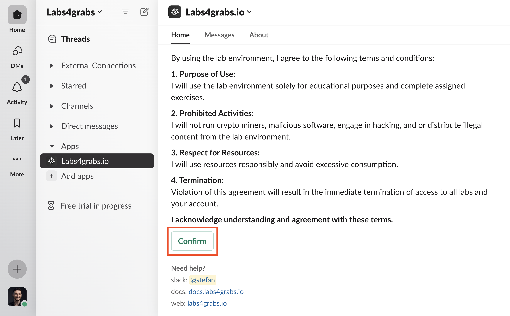
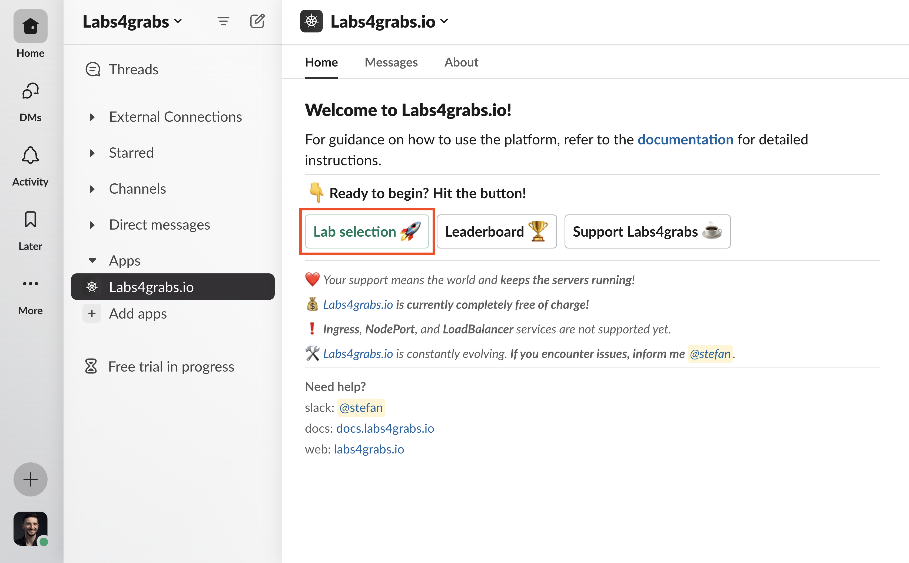
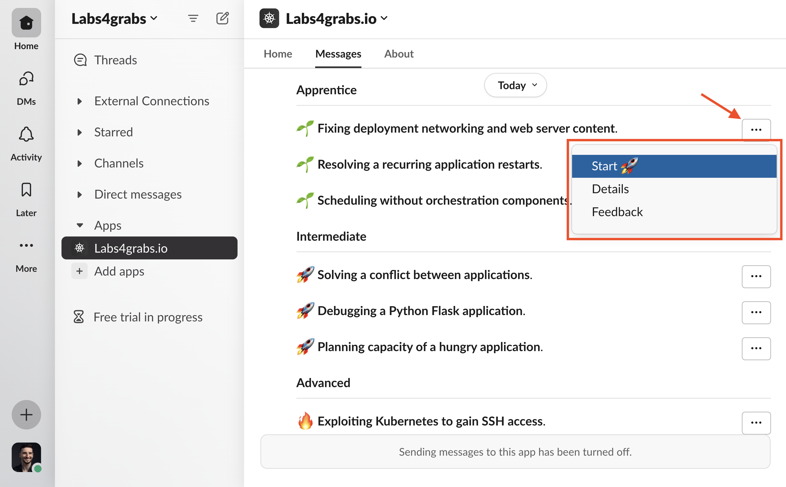
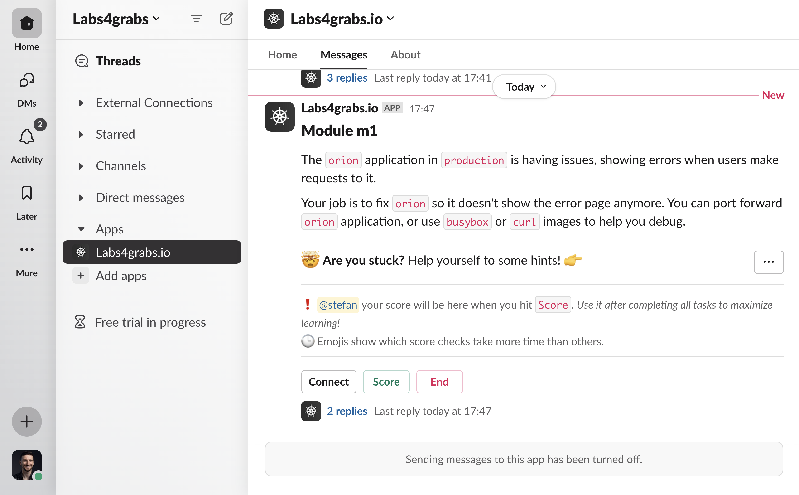
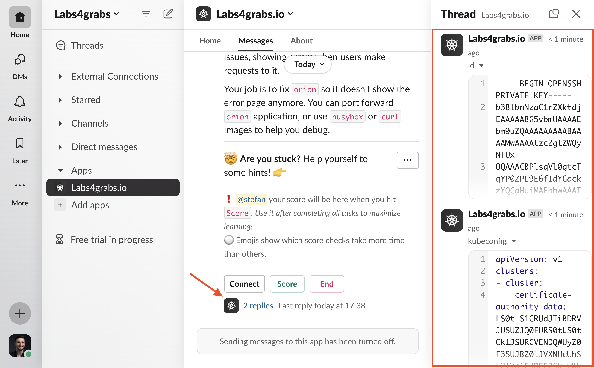
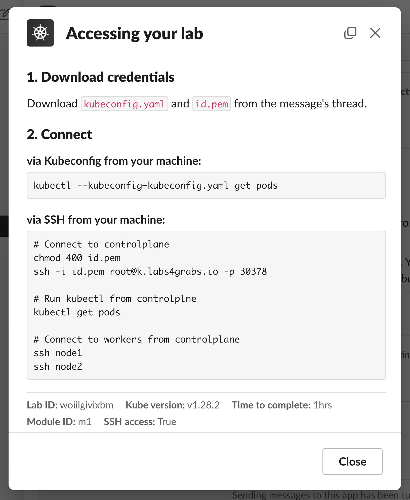
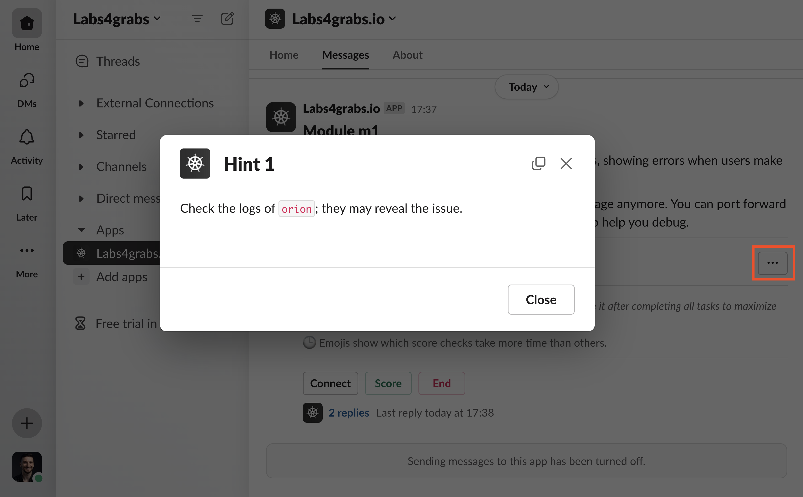
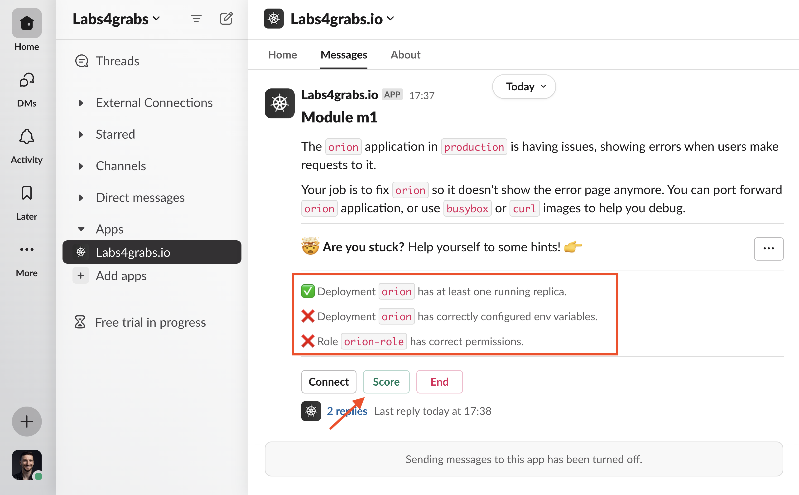
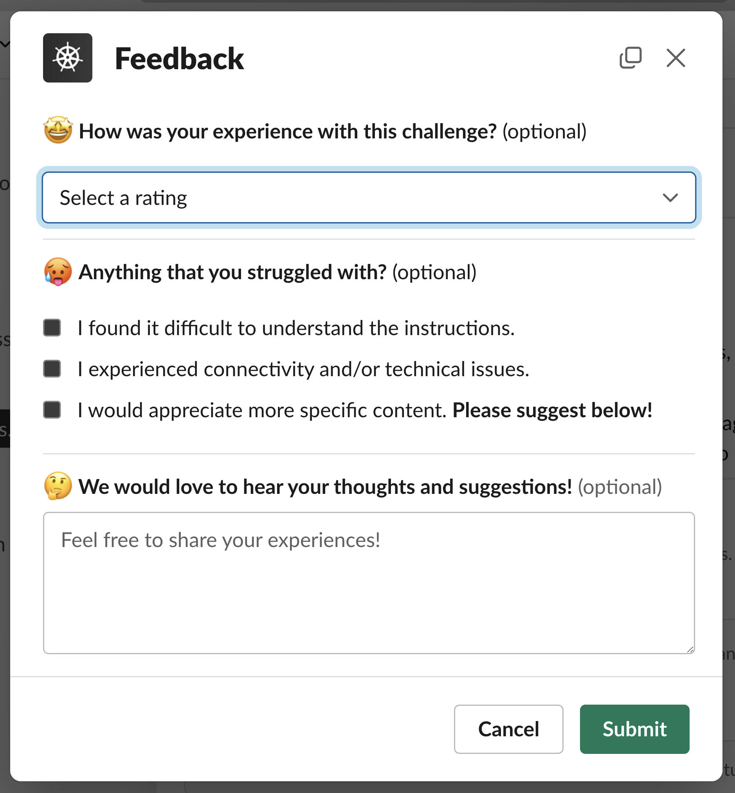

# Getting started
## Registration
1. To access and communicate with the platform, first, get an invitation to join the Slack workspace. You can obtain the invitation [here](https://join.slack.com/t/labs4grabs/shared_invite/zt-2dgmu432r-41in_skkdsaJMyufqGL8Dw){target=_blank}.

2. Go to App home and agree to the terms and conditions, which prohibit running harmful software in the lab environments.

    <figure markdown>
    { width="700" }
    </figure>

3. The Slack integration is now unlocked, you can start Kubernetes labs!

## Grab a lab

1. Click on **Lab selection** button, which will post a message in the messages tab of the integration.

    <figure markdown>
    { width="700" }
    </figure>

2. Go to the **App messages**. Use the menu next to each lab to find more information about the labs you're interested in, give feedback, or start them right away.

    !!! info "Keep trying"
        You can begin each lab more than once. The lab will remain available in the menu selection.

    <figure markdown>
    { width="700" }
    </figure>

3. When you start a lab, the menu selection message will be changed to a lab description message. This message will include the credentials required to access the lab in the thread.

    !!! warning "Parallel labs"
        You cannot run multiple labs at the same time!

    <figure markdown>
    { width="700" }
    </figure>

## Connecting to labs

1. Download either SSH or Kubeconfig credentials from the message thread.

    !!! info "Credentials"
        Some labs don't have SSH keys or Kubeconfig. So, they won't be sent to the message thread.

    <figure markdown>
    { width="700" }
    </figure>

2. Once you have downloaded the credentials, click on the **Connect button** at the bottom of the lab message to learn how to connect. If both methods are available, you can choose the one you are most comfortable with.

    !!! info "SSH keys"
        SSH keys need `chmod 400 id.pem` command to make them work!

    <figure markdown>
    { width="500" }
    </figure>

!!! note "Windows users"
    Windows users should refer to [this](windows.md) guide to set up their environment for using Labs4grabs.io.

## Help with your lab

1. To get help, open the **Hints menu** in the running lab message. But it's better to use it only when you really don't know what to do.

    <figure markdown>
    { width="700" }
    </figure>

2. You can also click the **Score button** at the bottom of the running lab message to instantly see your lab score. Use it sparingly, like hints, to make the most of your learning experience.

    !!! info "Score checks"
        Some score checks may take longer than others *(the longest ones take approximately 20 seconds)*. These checks are indicated by the :clock1: emoji.

    <figure markdown>
    { width="700" }
    </figure>

## Finishing labs
1. After completing a lab, simply click the **Lab end** button. This will recheck your score and show a feedback popup. If you have a moment, please share your experience with the platform. Your feedback is highly appreciated!

    !!! info "Running out of time"
        If you run out of time, the score check will run again, but the feedback pop-up will not appear. If you want to provide feedback, you can do so in the lab selection.

    <figure markdown>
    { width="500" }
    </figure>

## Score and Leaderboard
1. After ending the lab with the **End button** or timeout, the score function will run one last time. This time, it will write the score to the score table.

    !!! info "Refresh time"
        The leaderboard updates every 5-10 minutes. If you don't immediately see your updated score, don't worry! The app simply needs time to process.

2. The maximum number of points for each lab is 10. This total does not include automatically granted checks, nor does it decrease your score if you fail them during the lab runtime.

    <figure markdown>
    { width="500" }
    </figure>

### Score multiplier
There's a score multiplier for each difficulty:

| Difficulty | Multiplier |
| - | - |
| Apprentice| `1x` |
| Intermediate | `1.5x` |
| Advanced | `2x` |

_**Example**: Getting full score of a single advanced lab will yield you 20 points total._
